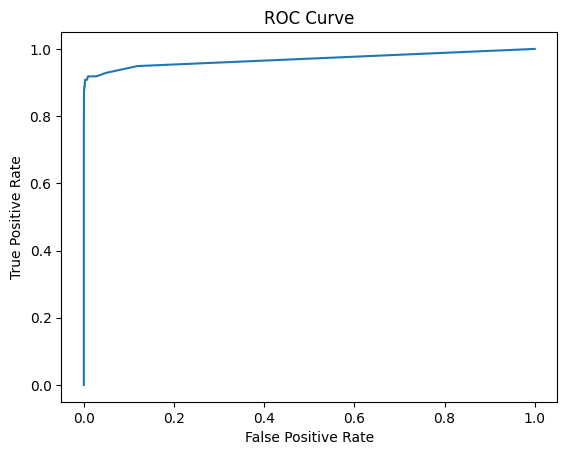
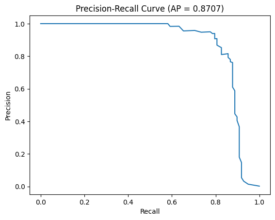

# Credit Card Fraud Detection using Machine Learning

## Overview

This project builds a fraud detection system to classify fraudulent credit card transactions on a highly imbalanced dataset (~0.17% fraud rate).

Unlike basic ML projects, this system:

Handles extreme class imbalance using SMOTE

Uses Stratified Cross Validation

Optimizes ROC-AUC

Tunes decision threshold

Simulates real-world financial impact

This project demonstrates applied machine learning, model evaluation, and business-aware optimization.

## Dataset

284,807 transactions

492 fraud cases (~0.17%)

30 features (PCA transformed + Amount + Time)

Binary classification problem

Highly imbalanced dataset typical in real-world fraud detection systems.

## Machine Learning Pipeline

### 1️. Data Processing

Stratified train-test split

Standard scaling (Amount feature)

SMOTE for class balancing

### 2️. Model Training

Random Forest Classifier

Class weighting

Optimized on ROC-AUC

### 3️. Advanced Evaluation

ROC-AUC Score

Precision-Recall Curve

F1 Score

Threshold optimization

Business cost simulation

## Results

| Metric	           | Score |
|--------------------|-------|
| ROC-AUC	           | 0.97  |
| Average Precision  | 0.97  |
| Optimized F1	     | 0.86  |
| Fraud Recall	     | 90%   |

-> Improved fraud detection using threshold optimization

-> Reduced estimated financial loss through cost-based evaluation

## Business Impact Simulation

Instead of using default 0.5 threshold:

Optimized threshold to maximize F1-score

Assigned higher cost to missed fraud (False Negatives)

Estimated financial impact of model decisions

This mirrors real-world fraud detection systems used in banking.

## Visualizations

ROC Curve

Precision-Recall Curve

##Project Structure
credit-card-fraud-detection/
│
├── data/
├── src/
│   ├── preprocessing.py
│   ├── model.py
│   ├── evaluation.py
├── notebook/
│   └── main.ipynb
├── requirements.txt
└── README.md

## Tech Stack

Python

Pandas

NumPy

Scikit-learn

Imbalanced-learn

Matplotlib
